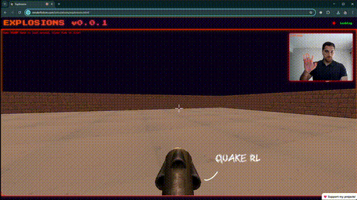

# Explosions - Computer Vision


# Demo
https://www.renderfiction.com/simulations/explosions.html

# How to Download
```
# Clone the respository
git clone https://github.com/gemsjohn/explosions-computer-vision.git

# Navigate to the download and add the folder to your code editor's workspace

# Right click explosions.html and Open with Live Server
```

# How to Use the Application
**Requirements**
- Use a modern web browser with WebGL support, web cam, and a keyboard (if you want to move around).

**Hand Gestures**
- Open right hand to look around, close fist to fire!

**Keyboard Controls**
- Use WASD keys move around the scene. W: Forward, A: Left, S: Backward, D: Right

# Support Me
If you get value from this content, consider following me on **X** [@renderfiction](https://x.com/renderfiction) !

[](https://www.buymeacoffee.com/renderfiction)
